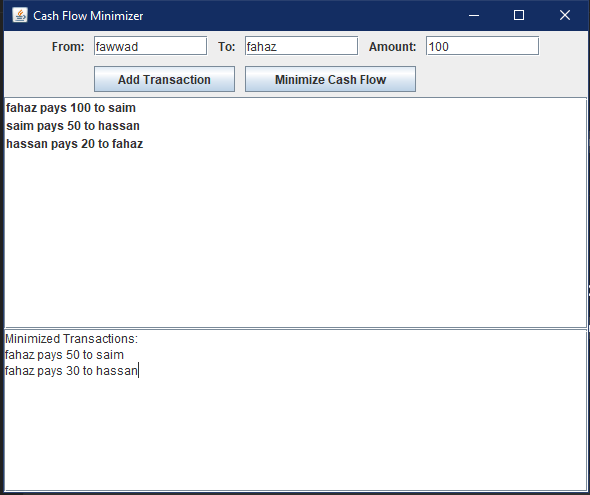

# 💸 Cash Flow Minimizer

<p align=center>
  
</p>

### Efficient Debt Settlement System | University Project

**Cash Flow Minimizer** is a Java-based desktop application that streamlines complex financial transactions within groups. Instead of everyone paying everyone, this tool uses a **Greedy Algorithm** to find the absolute minimum number of payments required to settle all debts.

---

## 🖥️ Application Flow
The application is designed with a user-friendly interface divided into three main modules:
1. **🏠 Home Page:** The main dashboard with navigation buttons to start a new session or learn about the logic.
2. **📝 Transaction Manager:** A dynamic input screen to record who owes what.
3. **⚙️ Minimization Engine:** The core DSA module that pairs debtors and creditors to settle accounts efficiently.

---

## 🧠 The "Greedy" Logic
The system uses a **Max-Heap (Priority Queue)** approach:
- It identifies the person with the most debt (**Maximum Debtor**) and the person who is owed the most (**Maximum Creditor**).
- It settles the maximum amount possible between them.
- This process repeats until all net amounts are zero.
- **Complexity:** This ensures a minimal number of transactions ($N-1$ at most, where $N$ is the number of people).

---

## 🛠️ Tech Stack & Folder Structure
- **Language:** Java
- **Framework:** Java Swing (AWT for Layouts)
- **Data Structures:** `HashMap`, `PriorityQueue`, `ArrayList`

```text
.
├── HomePage.java              # Entry point & Navigation Menu
├── CashFlowMinimizerGUI.java  # Main Logic & Transaction Entry
├── HowItWorksPage.java        # Documentation & Algorithm Explanation
└── Project_Report.pdf         # Detailed DSA analysis
````

-----

## 🚀 How to Run

Since this project uses modern Java standards, you can launch the entry point directly:

1.  **Clone the Repo:**

    ```bash
    git clone https://github.com/SHADOWRULIN/Cash-Flow-Minimizer-Java-DSA.git
    ```
2.  **Execute the Home Page:** Ensure you have the JDK installed.

    ```bash
    java HomePage.java
    ```
    
-----

## 👤 Author

**Muhammad Fahaz Khan** *Computer Science Undergraduate | UIT University*

  - **GitHub:** [@SHADOWRULIN](https://github.com/SHADOWRULIN)
  - **LinkedIn:** [Fahaz Khan](https://www.linkedin.com/in/muhammad-fahaz-khan-85b805293/)

----

## 📄 License
This project is licensed under the **MIT License**.
